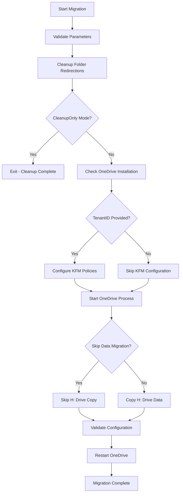

# System Administration Tools

A collection of PowerShell scripts for Windows system administration, specifically focused on OneDrive migration and folder redirection management.

## Scripts Overview

### 🖥️ Windows 11 Deployment

#### win11_deploy_simple.bat
Simple Windows 11 upgrade deployment script that downloads and runs the official upgrade script from a secure source. Designed to be lightweight and avoid antivirus false positives.

**Features:**
- Downloads Windows 11 upgrade script from secure URL
- Sets proper PowerShell execution policy temporarily
- Clean, minimal approach to avoid antivirus detection
- Automatic cleanup after execution

**Usage:**
```batch
win11_deploy_simple.bat
```

### 🚀 Complete-OneDrive-Migration.ps1 (RECOMMENDED)
**The comprehensive, all-in-one solution** that combines functionality from all other scripts into a single, optimized tool.

**Features:**
- ✅ Complete folder redirection cleanup (UNC paths, malformed GUIDs, H: drive references)
- ✅ OneDrive Known Folder Move (KFM) configuration
- ✅ Automated data migration from H: drive to local folders
- ✅ OneDrive process management and validation
- ✅ Comprehensive logging and error handling
- ✅ Multiple execution modes (WhatIf, CleanupOnly, SkipDataMigration)
- ✅ Enhanced OneDrive detection (fixes "OID not installed" errors)
- ✅ Optional TenantID parameter (no prompting required)

### 📁 Individual Component Scripts

#### Local-OD-Migrate-ADSHARE
Legacy script for H: drive to OneDrive migration. **Use Complete-OneDrive-Migration.ps1 instead.**

#### Clean up Home Directory Redirects.ps1
Legacy script for folder redirection cleanup. **Use Complete-OneDrive-Migration.ps1 instead.**

## Usage Examples

### Basic Migration (Recommended)
```powershell
# Run the complete migration process
.\Complete-OneDrive-Migration.ps1

# Preview what would happen without making changes
.\Complete-OneDrive-Migration.ps1 -WhatIf

# Run with specific tenant ID for KFM configuration
.\Complete-OneDrive-Migration.ps1 -TenantID "12345678-1234-1234-1234-123456789012"
```

### Specialized Use Cases
```powershell
# Only cleanup folder redirections (no OneDrive setup)
.\Complete-OneDrive-Migration.ps1 -CleanupOnly

# Migration without copying H: drive data
.\Complete-OneDrive-Migration.ps1 -SkipDataMigration

# Custom log location
.\Complete-OneDrive-Migration.ps1 -LogPath "C:\Logs\Migration.log"
```

## What the Migration Does

### 1. Folder Redirection Cleanup
- Scans registry for UNC paths (`\\server\share\path`)
- Removes H: drive references
- Fixes malformed GUID folder paths
- Resets all special folders to local paths:
  - Documents → `%USERPROFILE%\Documents`
  - Pictures → `%USERPROFILE%\Pictures`
  - Desktop → `%USERPROFILE%\Desktop`
  - Videos, Music, Favorites, Downloads

### 2. OneDrive Configuration (if TenantID provided)
- Configures Known Folder Move policies
- Sets up automatic sync for Desktop, Documents, Pictures
- Prevents users from opting out of folder sync
- Validates registry configuration

### 3. Data Migration
- Uses Robocopy for reliable file transfer
- Copies from H: drive to local user folders
- Handles network interruptions with retry logic
- Creates detailed transfer logs

### 4. Process Management
- Detects OneDrive installation via multiple methods
- Starts/restarts OneDrive as needed
- Applies policy changes automatically
- Refreshes Windows Explorer shell

## Parameters Reference

| Parameter | Type | Default | Description |
|-----------|------|---------|-------------|
| `-WhatIf` | Switch | False | Preview changes without executing |
| `-LogPath` | String | `$env:TEMP\OneDriveMigration.log` | Custom log file location |
| `-TenantID` | String | "" | Office 365 Tenant GUID for KFM |
| `-CleanupOnly` | Switch | False | Only perform folder redirection cleanup |
| `-SkipDataMigration` | Switch | False | Skip H: drive data copying |

## System Requirements

- Windows 10/11 or Windows Server 2016+
- PowerShell 5.1 or later
- OneDrive client installed
- Administrative privileges recommended
- Network access to H: drive (if applicable)

## Pre-Migration Checklist

1. ✅ OneDrive client is installed
2. ✅ User has Office 365 account access
3. ✅ H: drive is accessible (if data migration needed)
4. ✅ Sufficient local disk space for data copy
5. ✅ TenantID obtained from Office 365 admin (if KFM required)

## Post-Migration Steps

1. **User Login**: Ensure user signs into OneDrive
2. **Verify Sync**: Check OneDrive settings for Known Folder Move status
3. **Wait for Sync**: Allow initial synchronization to complete
4. **Validate Data**: Confirm all files are accessible through OneDrive
5. **Test Access**: Verify folder shortcuts work correctly

## Troubleshooting

### Common Issues

**"OneDrive not installed" despite OneDrive running**
- ✅ Fixed in Complete-OneDrive-Migration.ps1 with enhanced detection

**TenantID prompting interrupts automation**
- ✅ Fixed in Complete-OneDrive-Migration.ps1 with optional parameter

**Folder redirection not fully cleaned**
- ✅ Enhanced cleanup handles UNC paths, GUIDs, and server references

**Explorer not refreshing folder locations**
- ✅ Script includes shell refresh and Explorer restart capabilities

### Log Analysis
Check the migration log file for detailed information:
```powershell
Get-Content "$env:TEMP\OneDriveMigration.log" | Select-String "ERROR|WARN"
```

### Manual Verification
```powershell
# Check folder redirection status
Get-ItemProperty "HKCU:\SOFTWARE\Microsoft\Windows\CurrentVersion\Explorer\User Shell Folders"

# Verify OneDrive KFM settings
Get-ItemProperty "HKCU:\SOFTWARE\Policies\Microsoft\OneDrive"

# Check OneDrive process
Get-Process OneDrive -ErrorAction SilentlyContinue
```

## Migration Workflow



## Security Notes

- Scripts require appropriate permissions for registry modification
- Data is copied locally before OneDrive sync (not directly to cloud)
- TenantID validation prevents configuration with invalid GUIDs
- Comprehensive logging for audit trails
- WhatIf mode allows safe testing

## Version History

- **v2.0** - Complete-OneDrive-Migration.ps1 (Combined functionality)
- **v1.1** - Local-OD-Migrate-ADSHARE (Optimized, optional TenantID)
- **v1.0** - Individual component scripts

---

**Recommendation**: Use `Complete-OneDrive-Migration.ps1` for all new deployments. Legacy scripts are maintained for compatibility but the combined script provides superior functionality and error handling.